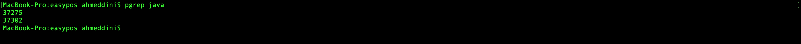

Follow the steps below to checkout the project.

## Step-by-step guide

1. first clone project this url https://github.com/luulsolutions/luulpos_backend
    
2. Click on the Clone button on the top left button of github screen.

3. Copy the git Command in the Clone button, you should get something like this but with your git username

```
git clone https://github.com/luulsolutions/luulpos_backend.git
```
4. Open a terminal on your Computer and paste the command above, you should see screen like the one below when you click Enter button of you computer


5. Now your project is cloned to your computer. cd to the project directory you just cloned like below:-
```
cd luulpos
```

6. Now you are in the root of the luulpos project. Now, Open the project with Eclipse (Please note your Eclipse must have JHipster plugin)
### 7.Once you have Eclipse opened, on Eclipse, Click on File → Import... then select Maven → Existing Maven Project ,

see the screenshot below


8. On the next page browse to where you have cloned your project and choose project  named luulpos then click Open. then click on the Finish button.

9. Eclipse will import your project as Maven Java Project, however, your project needs to download all the Maven Dependencies your project needs to your local computer to do this, so you need to right click on the project name then choose Maven→ Update Project, it will take time until Eclipse downloads all the Maven Dependencies and builds the project, wait unitl the Eclipse project build status to be built at the right side bottom,   see the screenshot below

10. Now, the project is ready, please Note the project we generated with JHipster is Monolithic application, which means your project contains the Java (Spring Boot app) as well as the User Interface Admin pages

      which are in React. So you need to build them separately with to separate commands,  

     To build the React components and also download the react modules run the command below in the root of luulpos project with a terminal, so open a terminal and run the command below:- This Assumes you

       have  yarn installed on your computer. If you don't have yarn, google how to install yarn,
```
 yarn install
```


Before we build the Spring Boot Java code, you first need to make sure that the database for the project is ready,

11.  To prepare the database for the project follow the instructions below:-

      a. First you need to have MySql installed on your computer, or you run the database as a docker image, if you don't want to install MySQL on your computer ask other members of the team how to run a MySQL

            docker image on your computer.

      b. Make sure your databases root username password is Stance60 as the project tries to access the database with username root and password Stance60.

      c. Make sure the database server is running. If you have Mac this is how you run MySQL database server from command line.  If you use, Ubuntu or Windows google how to run MySQL server
```
mysql.server start
```
      d. Now your database server is running and ready, access your database with the command below from command line terminal.
```
mysql -uroot -pStance60
```
Once you have successfully logged in to the database you should get something similar to the screenshot below:-

      e.  Now we need to create a database schema for our project, name the database schema this name luulpos, but before you do that make sure the database schema named luulpos does not already exits by

            running the command below:-
```
show databases;
```
You should get a list of existing databases. If the database schema doesn't exist run the command below to create the database.

```
create database luulpos;
```
Now, your database server is running and your database schema has been created.

12.  Build the Spring Boot Java application and run it using the command line below in a terminal. Note, we are using Maven Wrapper command and you don't need Maven to be installed on your computer to run this command our project has its own Maven Wrapper in the root.  So run the command below in the root of the luulpos project.
```
./mvnw
```

You should get something similar to the screenshot below:-


13. If everything successfully, your terminal output will be something similar to the screenshot below:-

14. Now your Spring Boot app and your React app are running together as one project.  To test it, Open a Browser, and in the address bar type this url http://localhost:8080

     You should get something similar to the screenshot below:-

15.  Now you need to login to the app using the username admin and password admin


Problems you Could face.

 1. If you have previously run the project and you forget to stop the project you will get a port 8080 conflict and running the project ./mvnw build will fail with error similar to the screenshot below:-

   Now you need to stop the previously running application in the background. So in a terminal run the command below:-
```
   pgrep java   
```
   Since our project is a Java project, the command above will list all the Linux Java processes running, see the screenshot below:-


Don't kill all Java projects, one of them could be your Eclipse, so you need to run a ps command on the process ids one by one and find one that includes jhipster keyword in it like the screenshot below:-
```
ps 37275
```
Note, your process IDs could be different from the example above, so use the process IDs you get as output

Now, Kill the process ID of the Java project running in the background using the command below
```
   sudo kill -9 37275
```
Now the process should be killed, and you can now run again
```
./mvnw
```