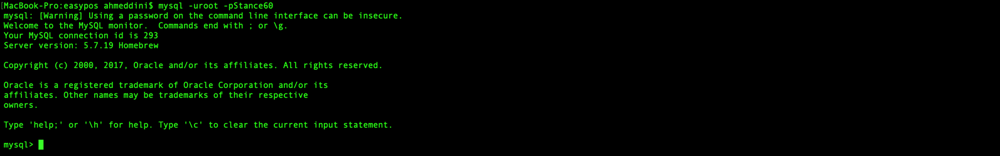
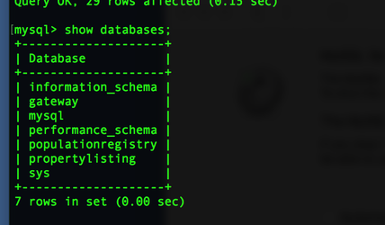
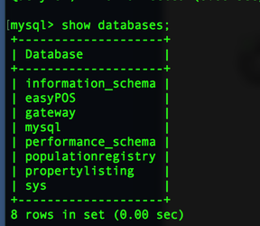
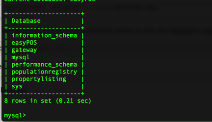
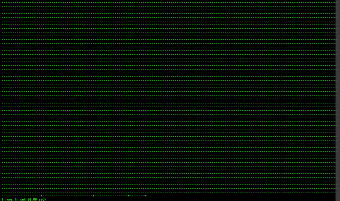

This will guide you how to import the easyPOS schema to the project database

## Step-by-step guide
These steps assume that you have already checked out the project into your local machine. if you didn't checkout the easyPOS project please go to the link below:

[How to checkout EasyPos Backend Maven Project and run](https://docusaurus.io)

## 1.prepare the database for the project follow the instructions below:-
a. First you need to have MySql installed on your computer, or you run the database as a docker image, if you don't want to install MySQL on your computer ask other members of the team how to run a MySQL docker image on your computer.

b. Make sure your databases root username password is Stance60 as the project tries to access the database with username root and password Stance60.

c. Make sure the database server is running. If you have Mac this is how you run MySQL database server from command line. 

If you use, Ubuntu or Windows google how to run MySQL server
         
```
mysql.server start

```

d. Now your database server is running and ready, access your database with the command below from command line terminal.


```
 mysql -uroot -pStance60

```
Once you have successfully logged in to the database you should get something similar to the screenshot below:
       
e. if the database easyPOS exists delete it by running the command below:

```
drop database  easyPOS;
```
f.  Now we need to create a database schema for our project, name the database schema this name easyPOS, but before you do that make sure the database schema named easypos does not already exits by following above step (e).
check the database by running the command below:-

```
 show databases;
```
you should see below result:
 

Then create the database  easyPOS by running the command below:
```
create database easyPOS;
```

Now check if the database easyPOS is created:
```
  show databases;
```


## 2. Now we need to import the data to the database easyPOS:
a. navigate to the project directory

b. run below command to import the data to MySql database:

```
mysql -uroot -pStance60 easyPOS < full-backup.sql
```
c. Go to mysql on the terminal and run the command below to check again the database easyPOS is created

```
show databases;
```
you will get a result like this: 

d. Then check if the tables are created in the easyPOS database by running the commands below:
```
use easyPOS;
```

and then,
```
select * from company;
```

You should the result below which show an empty table for company entity:


Now the data is being exported and a database schema named easyPOS is created for the project and  good to continue running the project.

 