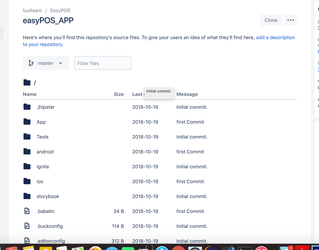

## first time to run react native app 


### make sure you have  installed nodejs,npm,yar
1.  Nodejs and npm  to install in  Ubuntu click here

2.  to install  yarn
```
npm install -g yarn 
```
## Step-by-step guide
   ### Step 1
First click this url: https://github.com/luulsolutions/luulpos_app

then click the clone button upper left corner 
  
   ### Step 2

you get a command like this
```
git clone https://maxto024@bitbucket.org/luulteam/easypos_app.git
cd easypos_app
git fetch && git checkout feature/me_folder
yarn install
```

  ### step 4

follow How to checkout EasyPos Backend Maven Project and run

  ### step 5 if you are using Ubuntu 
   we  need to IDEA

Install Visual Studio code  [Click Here.](https://developer.android.com/studio/)

install Android Studio  [Click Here.](https://developer.android.com/studio/?gclid=Cj0KCQiAjszhBRDgARIsAH8Kgvdnxl9sPs657CFp36_h08f7TBjr5T58AP1Ti4KdT6TA6l17oiHQ_70aAuDQEALw_wcB)
load your project to visual studio code 

### an example in Visual Studio code
  click the file and then Open than go the root of easypos _app and click open
    
    
```
  then go to Config/appConfig.js
``` 

   

and change your AppUrl to your local IP address

   


  ### step 6
run if not available create tablet simulator

   


  ### step 7
  
go back to terminal and

and run
```
react-native  run-android
```
 